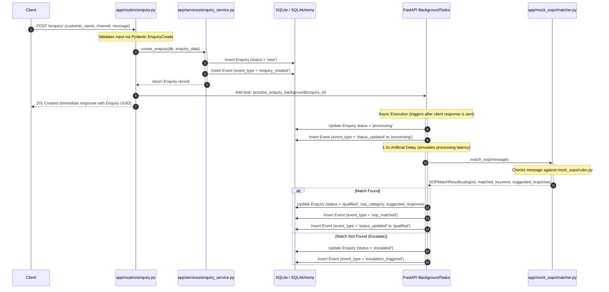
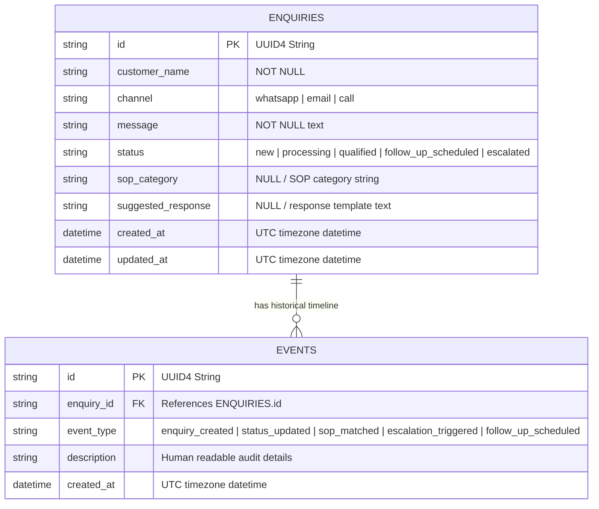

# Closira — Backend Architecture & Design Documentation

This document describes the technical architecture, design decisions, database schemas, and request lifecycles of the Closira backend platform.

---

## 1. Architectural Style & Design Principles

Closira is built as a **clean, layered vertical slice architecture** designed for high maintainability, observability, and testability. It adheres strictly to the following principles:

1. **Separation of Concerns (SoC):**
    * **Interface Layer (Routers):** Extremely thin controllers (`app/routers/`) that handle only HTTP concerns (routing, status codes, query parameters, Pydantic parsing).
    * **Business Logic Layer (Services):** All application-specific state transitions and processing algorithms reside in `app/services/`. These service functions are pure Python functions that accept database sessions, making them highly testable.
    * **Domain Layer (Models/Schemas):** SQLAlchemy models define physical database structures, and Pydantic schemas define standard input/output contracts.
    * **SOP Matching Engine (Pure Domain):** Isolated keyword rules and response templates under `app/mock_sops/` that operate purely on text inputs, detached from DB or network frameworks.
2. **Append-Only Event Tracking (Audit Trail):**
    * State changes, automated SOP matches, follow-ups, and manual escalations are stored chronologically in a separate `events` table. This creates an unmodifiable, structured audit timeline.
3. **Observability First:**
    * Standardized JSON log outputs are combined with context-scoped `correlation_id` values to enable tracing requests across asynchronous background borders.
4. **Resilience & Consistent API Contracts:**
    * Standardized global exception filters map all error responses (validation failures, HTTP errors, unexpected exceptions) to a single, unified JSON schema.

---

## 2. Request Lifecycle & Asynchronous Ingestion

The ingestion and async classification of a customer enquiry trace the following sequence:



---

## 3. Database Schema

The database model leverages SQLite for a self-contained local installation. SQLAlchemy ORM models establish relationships with strict cascade and sorting rules.



---

## 4. Observability & Logging Architecture

Observability is a core pillar of the Closira backend. It combines correlation tracking with structured logs.

### 4.1. Correlation IDs
* A custom FastAPI middleware (`request_observability_middleware`) intercepts every HTTP request.
* It extracts the `X-Correlation-ID` header if present, or generates a fresh `uuid4` string.
* This correlation ID is stored in a thread-safe, async-safe Python context variable (`ContextVar`) defined in `app/logging/config.py`.

### 4.2. JSON Formatter
The log formatter (`JSONFormatter`) formats every log record as a structured JSON object:
```json
{
  "timestamp": "2026-05-23T14:08:09.432218+00:00",
  "level": "INFO",
  "module": "app.services.enquiry_service",
  "message": "Enquiry created: 7c031e71-...",
  "correlation_id": "8d3e20e1-45a7-4bde-8f83-d23190ab7a22",
  "extra": {
    "enquiry_id": "7c031e71-837d-47e7-9e17-c6589a2487c1",
    "channel": "whatsapp",
    "customer_name": "Priya"
  }
}
```
Any logging call automatically includes the active `correlation_id` in its fields, connecting logs between the request-handling thread and the asynchronous FastAPI background thread executing the SOP matcher.

---

## 5. Unified Error Architecture

Instead of exposing default, generic stack traces or varying error response bodies, Closira implements a unified API contract for all failure paths.

### 5.1. Standard Success & Error Formats
All failure routes (HTTP 4xx/5xx) return a single, standard structure:
```json
{
  "success": false,
  "error": {
    "type": "<error_type>",
    "message": "<human_readable_message>"
  }
}
```

The application maps errors as follows:
* **`RequestValidationError` (`422 Unprocessable Entity`):** Formats standard Pydantic errors into a readable semicolon-delimited string (e.g., `body -> customer_name: String should have at least 1 character`) and sets error type to `validation_error`.
* **`HTTPException` (`404 Not Found` / `400 Bad Request`):** Captures standard HTTP errors and sets error type to `http_error`.
* **`Exception` (`500 Internal Server Error`):** A catch-all filter that logs full stack traces internally to preserve debugging capabilities while returning a generic, safe response message (`An unexpected error occurred. Please contact system support.`) to avoid security leaks, setting error type to `internal_server_error`.
