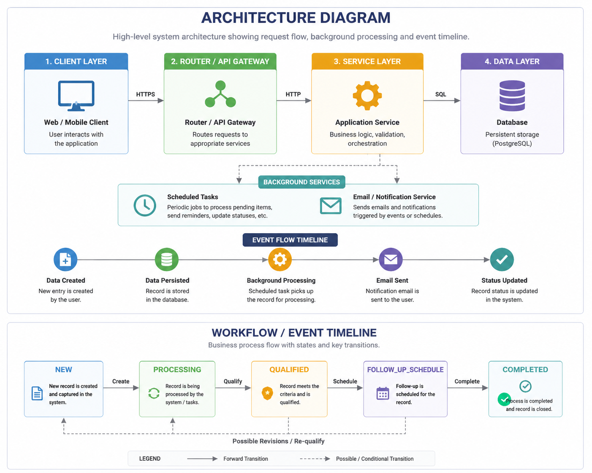

<h1 align="center">Closira Backend</h1>

<p align="center">
  
</p>

<p align="center">
  <strong>An AI-powered customer communication platform backend for SMBs.</strong><br>
  <em>Intelligently routes WhatsApp messages, Emails, and Calls using predefined SOP rules, automates responses, schedules follow-ups, and manages manual escalations.</em>
</p>

<br>

Closira is designed with a strong emphasis on production-inspired engineering practices, including structured logging, concurrency protection, and event sourcing.

---

## 🌟 Key Features

*   **Asynchronous Processing:** Non-blocking enquiry ingestion. Expensive tasks (like SOP matching) run via background threads to ensure fast API response times.
*   **Event-Sourced Timeline Audit:** Every state change, SOP match, or manual intervention is immutably logged into a chronological timeline table, ensuring total observability.
*   **Structured JSON Logging:** Fully machine-parseable logs ready for ELK/Datadog ingestion, featuring request correlation IDs (`X-Correlation-ID`) across middleware and execution threads.
*   **Concurrency Race-Condition Guards:** Advanced background task validation prevents stale data overwrites if an agent manually escalates an enquiry mid-processing.
*   **Domain Exception Handling:** Clean architectural boundaries. The service layer throws transport-agnostic domain exceptions (`EnquiryNotFoundError`), leaving the framework layer (`main.py`) to map them to HTTP responses.

---

## 📸 Screenshots

### Architecture & Workflow Diagram
<p align="center">
  
</p>

<!-- 
### Structured JSON Logs
<p align="center">
  
</p>
-->

---

## 📂 Project Structure

```text
Backend/
├── app/
│   ├── config.py             # Pydantic BaseSettings config
│   ├── database.py           # SQLAlchemy setup and session factory
│   ├── main.py               # FastAPI entry point, exception handlers, middleware
│   ├── logging/              # Structured JSON formatting & configuration
│   ├── mock_sops/            # Side-effect-free keyword matching & templates
│   ├── models/               # SQLAlchemy ORM models (Enquiry, Event)
│   ├── routers/              # HTTP layer (Thin controllers)
│   ├── schemas/              # Pydantic validation (Input/Output contracts)
│   ├── services/             # Core business logic & database transactions
│   └── utils/                # Domain exceptions and helpers
├── docs/                     # Architecture & Demo documentation
│   └── screenshots/          # Documentation assets and architecture diagrams
├── tests/                    # Unit testing configurations
├── verify_backend.py         # End-to-End automated validation script
├── requirements.txt          # Pinned dependencies
└── .env                      # Local environment configuration
```

---

## 🚀 Getting Started

### Prerequisites
*   Python 3.10+

### Local Setup

1. **Clone the repository and enter the Backend directory**
   ```bash
   cd Backend
   ```

2. **Create and activate a virtual environment**
   ```bash
   python -m venv venv
   # On Windows:
   venv\Scripts\activate
   # On Mac/Linux:
   source venv/bin/activate
   ```

3. **Install dependencies**
   ```bash
   pip install -r requirements.txt
   ```

4. **Start the API Server**
   ```bash
   uvicorn app.main:app --reload
   ```

5. **View Swagger Documentation**
   Open your browser to: [http://127.0.0.1:8000/docs](http://127.0.0.1:8000/docs)

---

## 🧪 Verification & Testing

The project includes a robust End-to-End (E2E) automated verification script that tests:
*   Root and Health metadata endpoints.
*   Global validation schemas and custom 404 domain exceptions.
*   The complete async lifecycle (Creation → SOP Match → Qualification).
*   Concurrency protection (Manual escalations during async sleep).
*   Chronological event sorting and query filtering bounds.

Run the test suite against a live server:
```bash
python verify_backend.py
```

---

## 📚 Documentation

For deeper dives into the system design and how to run a live demo:
*   [Architecture Documentation](Backend/docs/architecture.md) — Explains the request lifecycle, scalability tradeoffs, and background task safety.
*   [Demo Walkthrough Guide](Backend/docs/demo_walkthrough.md) — A step-by-step guide for testing the API workflows in Swagger.

---

## ⚙️ Engineering Decisions & Tradeoffs

To fit within the scope of an internship project while maintaining high architectural standards, several practical tradeoffs were made:

*   **SQLite over PostgreSQL:** Used for simplicity and zero-configuration local setup. To account for this, the app uses indexes carefully and keeps transaction windows short.
*   **In-Memory BackgroundTasks over Celery/Redis:** Used to avoid infrastructure bloat. To make this safe, explicit race condition guards and database rollbacks are implemented inside the task workers.
*   **Static Mock SOPs over LLMs:** The `mock_sops` module uses a pure, deterministic keyword matcher. This isolates the logic cleanly, making it extremely easy to swap out with an external OpenAI/LLM call in the future without breaking the router or service layers.
