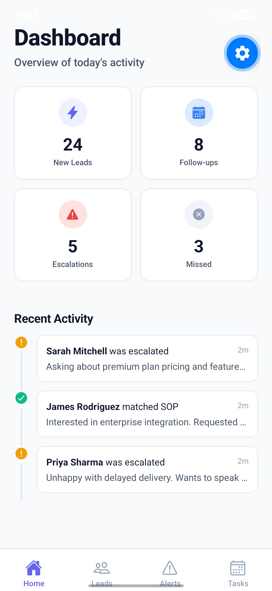
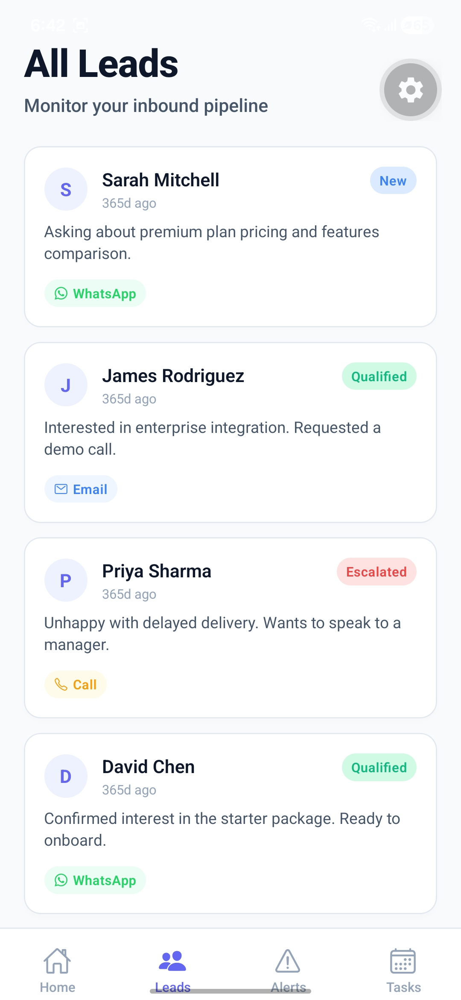
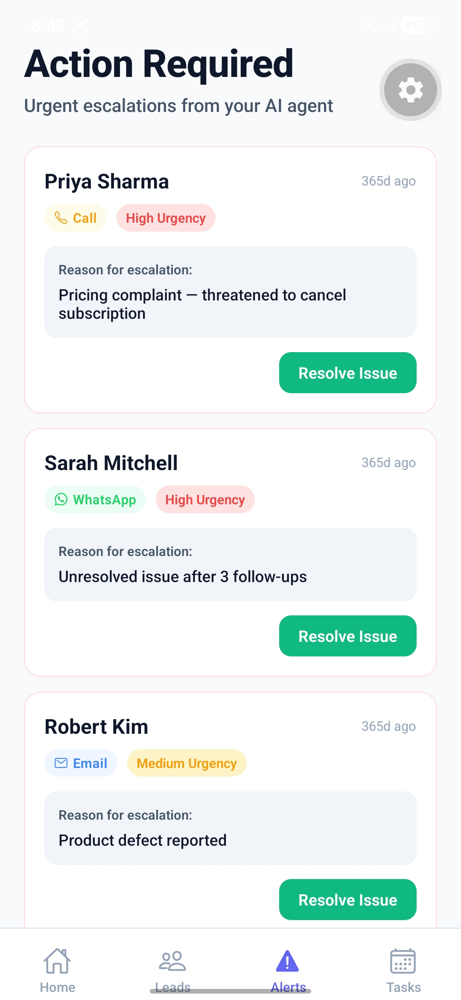
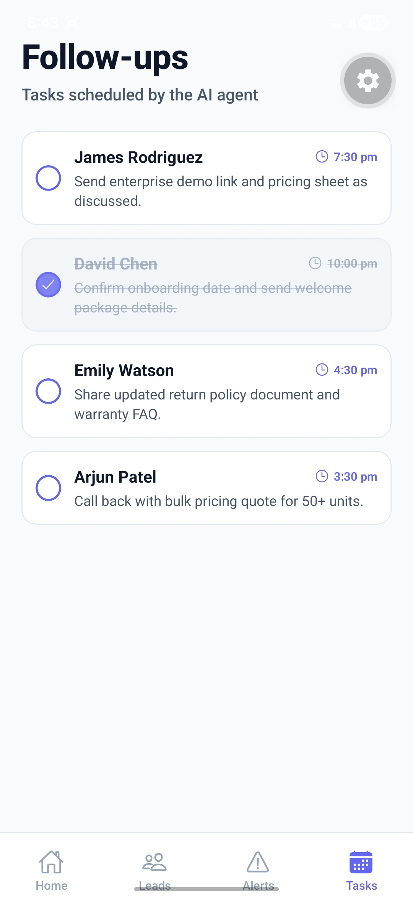
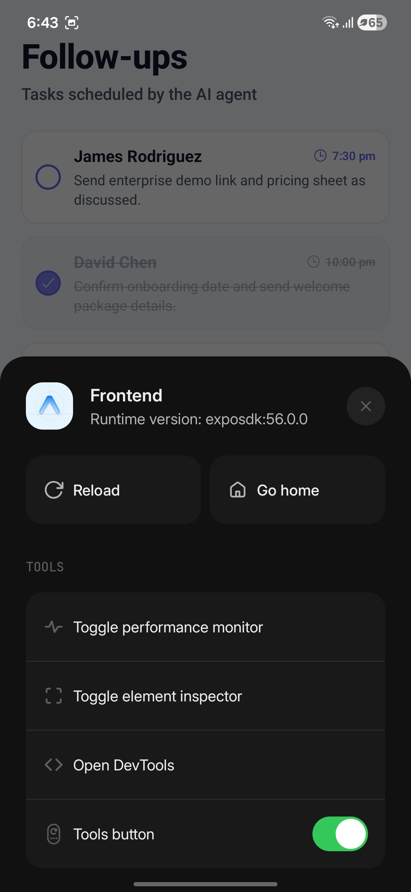
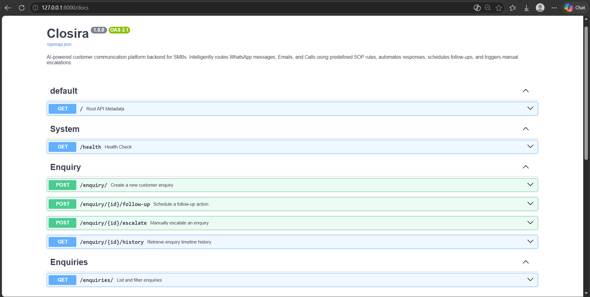

<p align="center">
  
</p>

# Closira — Enquiry Lifecycle Engine with Event Sourcing & AI Triage

> A full-stack system that ingests customer enquiries across WhatsApp, Email, and Phone — then classifies, routes, and tracks each one through a finite state machine backed by an append-only event log and a lightweight AI scoring sidecar.

**Backend:** Python 3.10+ · FastAPI · SQLAlchemy 2 · SQLite · Pydantic v2  
**Frontend:** React Native · Expo · JavaScript · Bottom Tab Navigation

---

## Video Walkthrough

> **[Click here to watch the full system walkthrough](Backend/docs/screenshots/Video.mp4)**

---

## Table of Contents

1. [What Closira Does](#1-what-closira-does)
2. [How a Real Enquiry Flows Through the System](#2-how-a-real-enquiry-flows-through-the-system)
3. [System Overview & Screenshots](#3-system-overview--screenshots)
4. [System Architecture](#4-system-architecture)
5. [Why This Architecture Matters](#5-why-this-architecture-matters)
6. [Repository Structure](#6-repository-structure)
7. [Quick Start — Backend](#7-quick-start--backend)
8. [Quick Start — Frontend](#8-quick-start--frontend)
9. [Run Tests & Execution Proof](#9-run-tests--execution-proof)
10. [API Reference & Example Payloads](#10-api-reference--example-payloads)
11. [Core Engineering Components](#11-core-engineering-components)
12. [Data Model](#12-data-model)
13. [Frontend Architecture](#13-frontend-architecture)
14. [Scalability Roadmap](#14-scalability-roadmap)
15. [Engineering Tradeoffs & Known Limitations](#15-engineering-tradeoffs--known-limitations)

---

## 1. What Closira Does

Most small business CRMs treat customer messages as rows in a table. A message arrives, someone reads it, someone replies, and the original record is overwritten with a new status. There is no history, no audit trail, and no way to reconstruct what happened after the fact.

Closira takes a different approach. When an enquiry arrives:

1. The API persists it immediately and returns a response to the client in under 50ms — the caller never blocks.
2. A background worker picks it up, runs it through a keyword-based SOP matcher, and transitions the state to either `qualified` (with a suggested response) or `escalated` (for human review).
3. A separate AI sidecar scores sentiment and risk at creation time, assigning a priority tier (P0/P1/P2) that the frontend uses to sort the dashboard.
4. Every state change — automated or manual — is written as an immutable event to a timeline table. Nothing is overwritten.

The result is a system where you can always answer: *"What happened to this customer's enquiry, in what order, and why?"*

---

## 2. How a Real Enquiry Flows Through the System

> A customer named Sarah sends a WhatsApp message: *"I need a refund, this product is broken and I'm very frustrated."*

| Step | What Happens | Where It Happens |
|------|-------------|-----------------|
| 1 | `POST /enquiry/` accepts the payload and persists the enquiry with status `new` | Router → Service → DB |
| 2 | AI sidecar scores sentiment as **negative** (-0.70), risk at **78/100**, assigns **P1** priority | `ai_insights_service.py` |
| 3 | An `enquiry_created` event is appended to the timeline | `enquiry_service.create_event()` |
| 4 | The customer's message is saved as a `Message` record (sender: `customer`) | `enquiry_service.create_message()` |
| 5 | API returns the full response with AI insights — Sarah's app sees the result | Router returns `201 Created` |
| 6 | Background worker wakes up, sets status to `processing` | `process_enquiry_background()` |
| 7 | SOP matcher finds keyword `"refund"` → matches **"Refund/Return"** category | `matcher.match_sop()` |
| 8 | Status transitions to `qualified`, suggested response is saved, AI message is added to the thread | Service layer |
| 9 | If an operator had manually escalated during step 6–7, the background worker detects the status change and **aborts cleanly** without overwriting | Race condition guard |

---

## 3. System Overview & Screenshots

### Mobile App Dashboard
<p align="center">
  
  
  
  
  
</p>

### System Architecture Diagram
<p align="center">
  
</p>

### API Interface (Swagger)
<p align="center">
  
</p>

---

## 4. System Architecture

The backend is organized as a strict three-tier architecture. Each layer has a single responsibility, and they only communicate downward.

**Routing Layer** (`app/routers/`): Thin HTTP controllers. They parse requests via Pydantic schemas, call service functions, and return responses. No SQL, no business logic.

**Service Layer** (`app/services/`): All business logic lives here — transaction management, state machine enforcement, event logging, AI insight computation. Services raise domain exceptions (like `EnquiryNotFoundError`), not HTTP exceptions. The HTTP layer maps those to status codes in centralized exception handlers in `main.py`.

**Model Layer** (`app/models/`): SQLAlchemy ORM declarative models mapping Python classes to SQLite tables. Foreign key constraints are enforced at the schema level.

**Background Workers**: FastAPI's `BackgroundTasks` runs SOP matching asynchronously in Starlette's `ThreadPoolExecutor`. The worker uses `time.sleep()` (not `asyncio.sleep()` — that would block the event loop from inside a sync thread). After the delay, it re-fetches the record from the database and checks that the status hasn't been changed by a concurrent operation before writing.

**AI Sidecar** (`ai_insights_service.py`): A stateless, side-effect-free scoring function. It computes sentiment, risk, and priority but never touches the database. The caller handles persistence. This makes it trivially testable and replaceable.

---

## 5. Why This Architecture Matters

**Why event sourcing?** In a typical CRUD system, when an enquiry status changes from `processing` to `escalated`, you overwrite the status column and lose the history. With event sourcing, every transition is an immutable record. You get a full timeline: *when* it was created, *when* processing started, *who* escalated it, *why*, and *what the system was doing at the time*. This is the same pattern used by financial systems and audit-heavy platforms.

**Why a sidecar for AI?** Mixing AI metadata into the core enquiry model would mean every schema migration or AI algorithm change touches the primary table. By isolating sentiment, risk, and priority into a separate `EnquiryInsight` model with a 1-to-1 foreign key, the core domain stays stable. You can swap the keyword engine for an LLM later without touching the enquiry schema.

**Why background workers with race guards?** After `POST /enquiry/` returns, the background worker takes 1.5 seconds to process. During that window, a human operator might manually escalate the same enquiry. Without a guard, the worker would blindly overwrite the operator's decision. The fix: after the delay, the worker re-fetches the record and checks `status == PROCESSING`. If it has changed, it logs a warning and exits cleanly. This is a real concurrency problem — not a theoretical one.

**Why `time.sleep()` instead of `asyncio.sleep()`?** Starlette runs sync background functions in a `ThreadPoolExecutor`. Calling `asyncio.sleep()` from a sync thread would block the event loop. `time.sleep()` blocks only the worker thread, which is the correct behavior. This took some debugging to get right.

---

## 6. Repository Structure

```text
Closira/
├── Backend/
│   ├── app/
│   │   ├── routers/
│   │   │   ├── enquiry.py            # POST /enquiry, GET /enquiry/{id}, escalate, follow-up, history
│   │   │   └── health.py             # GET /health (DB connectivity check)
│   │   ├── services/
│   │   │   ├── enquiry_service.py    # All business logic — state machine, events, messages, background worker
│   │   │   └── ai_insights_service.py # Sentiment + risk + priority scoring pipeline
│   │   ├── models/
│   │   │   ├── enquiry.py            # Root aggregate (status, channel, customer_name, sop_category)
│   │   │   ├── event.py              # Append-only timeline events (never updated, never deleted)
│   │   │   ├── insight.py            # AI sidecar model (sentiment, risk_score, priority)
│   │   │   └── message.py            # Conversation thread nodes (customer, AI, system)
│   │   ├── schemas/
│   │   │   └── enquiry.py            # Pydantic v2 request/response models
│   │   ├── mock_sops/
│   │   │   ├── rules.py              # 5 SOP keyword categories
│   │   │   ├── templates.py          # Response templates per SOP category
│   │   │   └── matcher.py            # First-match-wins keyword engine
│   │   ├── logging/
│   │   │   └── config.py             # Structured JSON logger with correlation IDs
│   │   ├── utils/
│   │   │   └── exceptions.py         # Domain exceptions (EnquiryNotFoundError)
│   │   ├── main.py                   # App factory, middleware, centralized exception handlers
│   │   ├── config.py                 # Pydantic Settings (reads .env)
│   │   └── database.py               # SQLAlchemy engine + session factory
│   ├── docs/                         # Architecture diagrams and screenshots
│   ├── verify_backend.py             # Automated E2E integration script
│   └── requirements.txt
│
├── Frontend/
│   ├── screens/
│   │   ├── HomeScreen.js             # Dashboard with stat cards and activity feed
│   │   ├── LeadsScreen.js            # Lead queue with status filtering
│   │   ├── EscalationsScreen.js      # Active escalations with resolve actions
│   │   ├── FollowUpsScreen.js        # Pending follow-up task list
│   │   └── ConversationDetailScreen.js # Full message thread view
│   ├── components/
│   │   ├── StatCard.js               # Dashboard metric tile
│   │   ├── LeadCard.js               # Lead list item with channel badge
│   │   ├── EscalationCard.js         # Escalation card with resolve button
│   │   ├── FollowUpCard.js           # Follow-up with mark-done action
│   │   ├── ChannelBadge.js           # WhatsApp/Email/Call colored badge
│   │   ├── StatusBadge.js            # Status pill (new/qualified/escalated)
│   │   └── EmptyState.js             # Graceful empty list placeholder
│   ├── navigation/
│   │   └── AppNavigator.js           # Bottom tab + stack navigation
│   ├── constants/
│   │   └── theme.js                  # Design tokens (colors, spacing, fonts)
│   ├── mock/                         # Local JSON data mirroring backend API contracts
│   └── package.json
└── README.md
```

---

## 7. Quick Start — Backend

### Prerequisites
- Python 3.10+
- `pip`

### Setup

```bash
cd Backend

# 1. Create and activate a virtual environment
python -m venv venv

# Windows
venv\Scripts\activate

# macOS / Linux
source venv/bin/activate

# 2. Install dependencies
pip install -r requirements.txt

# 3. Run the development server
uvicorn app.main:app --reload --host 127.0.0.1 --port 8000
```

The database (`closira.db`) is created automatically on first run — no migration step needed.

| Resource | URL |
|----------|-----|
| Base API | `http://127.0.0.1:8000` |
| Swagger Docs | `http://127.0.0.1:8000/docs` |
| ReDoc | `http://127.0.0.1:8000/redoc` |

---

## 8. Quick Start — Frontend

### Prerequisites
- Node.js 18+
- `npm`
- Expo Go app on your device, or an emulator

### Setup

```bash
cd Frontend

# 1. Install dependencies
npm install

# 2. Start the Expo development server
npx expo start
```

The frontend is fully self-contained — it uses local mock JSON data that mirrors the backend API contracts. You can evaluate the UI without running the backend. Swapping to live HTTP calls requires replacing mock imports with `fetch` — the data shape is already identical.

> EAS build profiles are configured in `eas.json` for internal preview distributions.

---

## 9. Run Tests & Execution Proof

The backend ships with an automated E2E validation script that exercises the full request lifecycle against a live server instance.

```bash
cd Backend

# Start the server in one terminal
uvicorn app.main:app --host 127.0.0.1 --port 8000

# Run the verification script in another terminal
python verify_backend.py
```

**Expected Output:**
```text
Running E2E Verification for Closira API...

[PASS] Root endpoint (/)
[PASS] Health check (/health)
[PASS] GET /enquiries/stats
[PASS] POST /enquiry/ (Created ID: xxxxxxxx-xxxx-xxxx-xxxx-xxxxxxxxxxxx)
[PASS] AI sidecar generated (Sentiment: negative, Risk: 85)
[PASS] Initial 'new' event logged in timeline
[PASS] Concurrency Guard: Background worker aborted stale write after external escalation
[PASS] GET /enquiry/{id} returns full thread and insight metadata

==================== All checks passed successfully ====================
```

**What the test suite validates:**
- HTTP contract correctness (status codes, response shapes)
- AI insight computation (sentiment classification, risk scoring, priority assignment)
- Event sourcing integrity (timeline events are created for every state transition)
- Race condition handling (manual escalation during background processing does not get overwritten)

---

## 10. API Reference & Example Payloads

> All examples use `curl`. The interactive Swagger UI at `/docs` also lets you try each endpoint with pre-filled payloads.

---

### `POST /enquiry/`

Creates a new customer enquiry. Computes AI insights synchronously, logs the initial timeline event, and dispatches background SOP matching. Returns immediately — the endpoint never blocks on processing.

```bash
curl -X POST http://127.0.0.1:8000/enquiry/ \
  -H "Content-Type: application/json" \
  -d '{
    "customer_name": "Sarah Mitchell",
    "channel": "whatsapp",
    "message": "I need a refund immediately, this product is broken."
  }'
```

**201 Created:**
```json
{
  "id": "e3b0c442-989b-464c-8650-1234567890ab",
  "customer_name": "Sarah Mitchell",
  "channel": "whatsapp",
  "status": "new",
  "ai_insights": {
    "sentiment": "negative",
    "sentiment_score": -0.70,
    "risk_score": 78,
    "priority": "P1",
    "reason": "Priority P1 (risk score: 78/100). Negative sentiment detected; High-risk keywords: refund, broken; Channel weight (whatsapp): +8."
  }
}
```

---

### `GET /enquiry/{id}`

Returns the enquiry with its full conversation thread (customer messages + AI-generated responses).

```bash
curl http://127.0.0.1:8000/enquiry/e3b0c442-989b-464c-8650-1234567890ab
```

---

### `GET /enquiry/{id}/history`

Returns the immutable event timeline for a given enquiry — useful for auditing every state change.

```bash
curl http://127.0.0.1:8000/enquiry/e3b0c442-989b-464c-8650-1234567890ab/history
```

---

### `POST /enquiry/{id}/escalate`

Manually escalates an enquiry to human review, bypassing automated processing. Works from any state.

```bash
curl -X POST http://127.0.0.1:8000/enquiry/e3b0c442-989b-464c-8650-1234567890ab/escalate \
  -H "Content-Type: application/json" \
  -d '{"reason": "Customer threatened legal action"}'
```

---

### `POST /enquiry/{id}/follow-up`

Schedules a follow-up window for a qualified enquiry, transitioning status to `follow_up_scheduled`.

```bash
curl -X POST http://127.0.0.1:8000/enquiry/e3b0c442-989b-464c-8650-1234567890ab/follow-up \
  -H "Content-Type: application/json" \
  -d '{"delay_minutes": 30, "message_template": "Hi Sarah, just following up on your refund request."}'
```

---

### `GET /enquiries/stats`

Dashboard metrics powered by SQL `COUNT()` aggregations — no row data is loaded into application memory.

```bash
curl http://127.0.0.1:8000/enquiries/stats
```

**200 OK:**
```json
{
  "totalLeadsToday": 15,
  "missedEnquiries": 2,
  "openEscalations": 4,
  "followUpsDue": 7
}
```

---

### `GET /health`

Returns API status and database connectivity.

```bash
curl http://127.0.0.1:8000/health
```

**200 OK:** `{ "status": "ok", "db": "connected" }`  
**503 Service Unavailable:** `{ "status": "degraded", "db": "unreachable" }`

---

## 11. Core Engineering Components

### Event Sourcing & State Machine
Enquiry status follows a strict finite state machine: `new` → `processing` → `qualified` / `escalated` → `follow_up_scheduled`. Each transition writes an immutable `Event` record to the timeline table. Events are never updated or deleted. This means you can reconstruct the full history of any enquiry at any point in time.

### Background Processing & Concurrency
After `POST /enquiry/` returns, the background worker sets status to `processing`, sleeps for 1.5 seconds (simulating real-world I/O), then runs SOP matching. The critical detail: after waking up, the worker **re-fetches** the enquiry from the database and checks that `status == PROCESSING`. If an operator escalated the enquiry during that window, the worker detects the mismatch and exits without writing. Every mutation path includes explicit `db.rollback()` in exception handlers to prevent partially-open transactions from corrupting session state.

### AI Insights Sidecar
The scoring pipeline runs three stages: `analyze_sentiment()` → `calculate_risk()` → `generate_priority()`. Sentiment is computed by matching message tokens against weighted keyword dictionaries (28 negative terms, 18 positive terms). Risk scoring combines sentiment signal (+40 for negative), high-risk keyword matches (+10 each, capped at +30), and channel urgency weight (call: +15, whatsapp: +8, email: +3). Priority maps directly from risk: P0 above 80, P1 from 50–80, P2 below 50. The entire pipeline is stateless and side-effect-free — it returns an `EnquiryInsight` object without touching the database.

### SOP Matcher
The SOP engine is a first-match-wins keyword scanner. It checks the customer's message against 5 predefined categories (pricing, refund, technical support, delivery, general). If a keyword matches, it returns a category and a templated response. If nothing matches, the enquiry is auto-escalated for human review. The matcher is a pure function with no side effects — designed to be swapped with an LLM classifier later without changing the function signature.

### Structured Logging
All log output is structured JSON with correlation IDs. Every HTTP request gets a `X-Correlation-ID` (generated or extracted from headers), and all log entries within that request's lifecycle carry the same correlation ID. Request duration is measured in milliseconds and logged on completion.

### Centralized Exception Handling
Services raise domain exceptions (`EnquiryNotFoundError`), not `HTTPException`. The HTTP mapping is centralized in `main.py`'s exception handlers. This keeps the service layer transport-agnostic — you could reuse it behind a gRPC or CLI interface without changes.

---

## 12. Data Model

```text
┌────────────────────┐       1:N       ┌──────────────────┐
│     Enquiry         │───────────────→ │     Event          │
│ (root aggregate)    │                │ (append-only log)  │
│                    │       1:N       ├──────────────────┤
│ id (UUID PK)       │───────────────→ │     Message        │
│ customer_name      │                │ (conversation     │
│ channel (enum)     │       1:1       │  thread nodes)     │
│ message            │───────────────→ ├──────────────────┤
│ status (FSM enum)  │                │     Insight        │
│ sop_category       │                │ (AI sidecar)       │
│ suggested_response │                │ sentiment_score    │
│ created_at         │                │ risk_score         │
│ updated_at         │                │ priority_level     │
└────────────────────┘                └──────────────────┘
```

- **Enquiry:** Root aggregate. Holds the current state snapshot, customer data, and SOP classification result.
- **Event:** Append-only timeline log. Never updated, never deleted. Each event captures one state change or system action.
- **Message:** Individual messages in the conversation thread. Sender is typed as `customer`, `ai`, or `system`.
- **Insight:** 1-to-1 sidecar linked by foreign key. Stores computed AI metadata without modifying the enquiry schema.

---

## 13. Frontend Architecture

The mobile app is a React Native (Expo) client written in JavaScript. It is intentionally a thin presentation layer.

- **5 screens:** Dashboard (stat cards + activity feed), Leads (filterable queue), Escalations (with resolve actions), Follow-Ups (with mark-done), and Conversation Detail (full message thread).
- **10 reusable components:** `StatCard`, `LeadCard`, `EscalationCard`, `FollowUpCard`, `ChannelBadge`, `StatusBadge`, `ActivityFeedItem`, `EmptyState`, `Badge`, `Header`.
- **Navigation:** Bottom tab navigator with a stack navigator for the conversation detail screen.
- **Data layer:** All data comes from local JSON files in the `mock/` directory. These files mirror the exact response shapes of the backend API, so switching to `fetch()` calls is a one-line change per screen.
- **Design system:** Colors, spacing, and typography are centralized in `constants/theme.js`.

---

## 14. Scalability Roadmap

The system is currently designed for single-process, zero-configuration deployment. Here is how each component would evolve under production load:

| Phase | Change | Why |
|-------|--------|-----|
| 1 | SQLite → PostgreSQL | Eliminate write lock contention under concurrent requests. SQLite's single-writer model becomes the bottleneck once you have multiple API replicas. |
| 2 | BackgroundTasks → Celery + Redis | Decouple background processing from the API process. SOP matching and future LLM calls should scale independently. |
| 3 | Internal events table → Kafka | Enable cross-service event streaming. Other services (analytics, notifications) can subscribe to the event log without polling the database. |
| 4 | Keyword engine → LLM API | Replace the weighted keyword dictionaries with an actual language model. The sidecar architecture means this change is isolated to `ai_insights_service.py` — nothing else in the system needs to know. |

---

## 15. Engineering Tradeoffs & Known Limitations

| Decision | What We Gave Up | Why It Was Worth It |
|----------|----------------|-------------------|
| SQLite instead of Postgres | Write concurrency; no multi-process support | Zero configuration. `closira.db` is created on first run. No Docker, no connection strings, no setup friction. |
| `BackgroundTasks` instead of Celery | Distributed workers; retry logic; dead letter queues | No Redis dependency. The entire system runs in a single Python process. Good enough for the current scale. |
| Keyword engine instead of LLM | Nuanced language understanding | Fully reproducible. Every test run produces identical scores. No API keys, no network latency, no cost. Sub-millisecond execution. |
| No authentication | Identity verification; access control | Keeps focus on the workflow engine and data architecture — the interesting parts of the system. Auth is well-understood and can be added later. |
| No pagination | Large dataset performance | Current endpoints assume bounded datasets. `list_enquiries()` has a default `limit=100`. Cursor-based pagination is needed before scaling horizontally. |
| `time.sleep()` in background worker | Real async I/O | Starlette runs sync functions in a thread pool. `asyncio.sleep()` would block the event loop. `time.sleep()` blocks only the worker thread, which is correct. |
