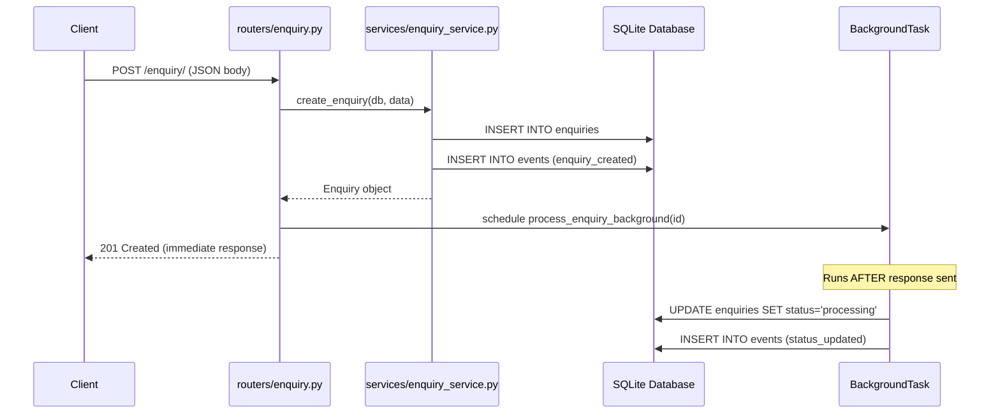
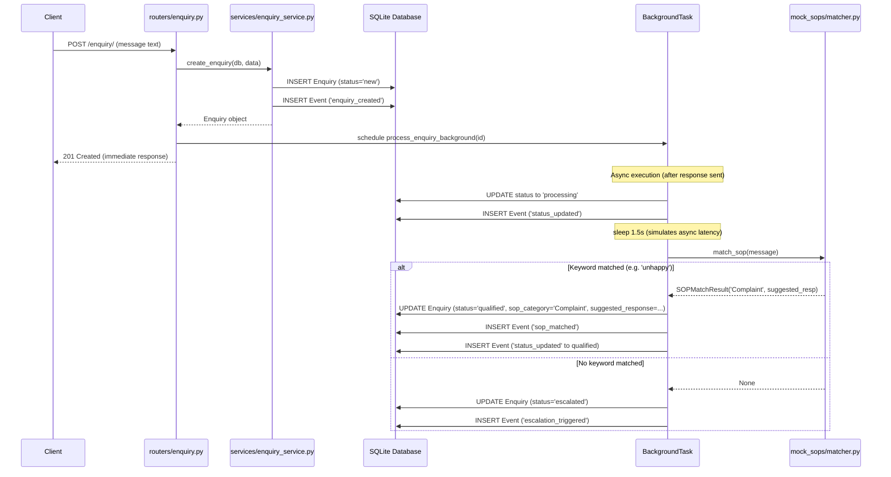

# Closira — Walkthrough Audit

## Step 1: Project Foundation

### What was built
FastAPI skeleton, SQLite database, structured JSON logging, and `/health` endpoint.

### Files Created

| File | Purpose |
|------|---------|
| [.env](file:///c:/Users/Akanksha Shirke/OneDrive/Documents/Projects/Closira/backend/.env) | Environment config (`APP_NAME`, `DATABASE_URL`, `DEBUG`) |
| [requirements.txt](file:///c:/Users/Akanksha Shirke/OneDrive/Documents/Projects/Closira/backend/requirements.txt) | Pinned Python dependencies (FastAPI, SQLAlchemy, uvicorn, etc.) |
| [README.md](file:///c:/Users/Akanksha Shirke/OneDrive/Documents/Projects/Closira/backend/README.md) | Setup instructions and project overview |
| [app/config.py](file:///c:/Users/Akanksha Shirke/OneDrive/Documents/Projects/Closira/backend/app/config.py) | Pydantic `BaseSettings` — type-safe config from `.env` |
| [app/database.py](file:///c:/Users/Akanksha Shirke/OneDrive/Documents/Projects/Closira/backend/app/database.py) | SQLAlchemy engine, session factory, `Base`, `get_db()` dependency |
| [app/logging/config.py](file:///c:/Users/Akanksha Shirke/OneDrive/Documents/Projects/Closira/backend/app/logging/config.py) | JSON formatter + `get_logger()` factory |
| [app/routers/health.py](file:///c:/Users/Akanksha Shirke/OneDrive/Documents/Projects/Closira/backend/app/routers/health.py) | `GET /health` with DB connectivity check |
| [app/main.py](file:///c:/Users/Akanksha Shirke/OneDrive/Documents/Projects/Closira/backend/app/main.py) | FastAPI app with lifespan, metadata, router registration |

### Architecture Decisions

1. **Pydantic `BaseSettings`** instead of raw `os.getenv()` — validated at startup, type-safe, centralized
2. **SQLAlchemy with `check_same_thread=False`** — required for SQLite + FastAPI's threading model
3. **Lifespan context manager** instead of deprecated `@app.on_event("startup")` — modern FastAPI pattern
4. **Structured JSON logging** from Day 1 — machine-parseable, production-ready
5. **Health endpoint checks DB** — a running API with a broken database is still broken

### Verification

```
GET /health → 200
{"status": "healthy", "database": "connected"}
```

---

## Step 2: Enquiry Domain

### What was built
Database models (Enquiry + Event), Pydantic schemas, enquiry service layer, `POST /enquiry` endpoint with background task processing.

### Files Created

| File | Purpose |
|------|---------|
| [app/models/enquiry.py](file:///c:/Users/Akanksha Shirke/OneDrive/Documents/Projects/Closira/backend/app/models/enquiry.py) | `Enquiry` model + `EnquiryStatus` / `ChannelType` enums |
| [app/models/event.py](file:///c:/Users/Akanksha Shirke/OneDrive/Documents/Projects/Closira/backend/app/models/event.py) | `Event` model (append-only timeline) |
| [app/models/__init__.py](file:///c:/Users/Akanksha Shirke/OneDrive/Documents/Projects/Closira/backend/app/models/__init__.py) | Imports all models so SQLAlchemy sees them for table creation |
| [app/schemas/enquiry.py](file:///c:/Users/Akanksha Shirke/OneDrive/Documents/Projects/Closira/backend/app/schemas/enquiry.py) | `EnquiryCreate` (input) + `EnquiryResponse` (output) schemas |
| [app/services/enquiry_service.py](file:///c:/Users/Akanksha Shirke/OneDrive/Documents/Projects/Closira/backend/app/services/enquiry_service.py) | Business logic: `create_enquiry()`, `create_event()`, `process_enquiry_background()` |
| [app/routers/enquiry.py](file:///c:/Users/Akanksha Shirke/OneDrive/Documents/Projects/Closira/backend/app/routers/enquiry.py) | `POST /enquiry/` — thin router delegating to service |

### Files Modified

| File | Change |
|------|--------|
| [app/main.py](file:///c:/Users/Akanksha Shirke/OneDrive/Documents/Projects/Closira/backend/app/main.py) | Added enquiry router registration + models import |

### Architecture Decisions

#### 1. UUID Primary Keys
- Prevents enumeration attacks (no `/enquiry/1`, `/enquiry/2`)
- Production-ready pattern used in real-world APIs

#### 2. Enum Types (`EnquiryStatus`, `ChannelType`)
- Inherit from `str` for clean serialization in both DB and API
- FastAPI auto-generates dropdown selectors in Swagger docs
- Single source of truth for the status lifecycle:

```
new → processing → qualified → follow_up_scheduled → resolved
                 ↘ escalated
```

#### 3. Separate Input/Output Schemas
- `EnquiryCreate`: strict validation (min/max lengths, enum enforcement)
- `EnquiryResponse`: controlled output with `from_attributes=True` for SQLAlchemy
- Never expose internal DB columns directly to clients

#### 4. Service Layer Pattern
- All business logic in `services/enquiry_service.py`, NOT in routers
- Router is thin glue: parse request → call service → return response
- Services are testable without HTTP

#### 5. Background Task with Own Session
- `process_enquiry_background()` creates its **own** `SessionLocal()` instance
- Background tasks run outside the request lifecycle — they cannot share the request's DB session
- SOP matching logic will plug into this function in Step 3

#### 6. Append-Only Event Model
- Events are never updated or deleted, only created
- `event_type` is a plain string (not enum) for flexibility — adding new event types requires zero migrations
- Creates a clean audit trail of everything that happened to an enquiry

### Database Schema

```sql
CREATE TABLE enquiries (
    id           VARCHAR(36)  PRIMARY KEY,
    customer_name VARCHAR(255) NOT NULL,
    channel      VARCHAR(8)   NOT NULL,    -- whatsapp | email | call
    message      TEXT         NOT NULL,
    status       VARCHAR(19)  NOT NULL,    -- new | processing | qualified | escalated | ...
    sop_category VARCHAR(255),             -- NULL until SOP matching runs
    suggested_response TEXT,               -- NULL until SOP matching runs
    created_at   DATETIME     NOT NULL,
    updated_at   DATETIME     NOT NULL
);

CREATE TABLE events (
    id          VARCHAR(36)  PRIMARY KEY,
    enquiry_id  VARCHAR(36)  NOT NULL REFERENCES enquiries(id),
    event_type  VARCHAR(100) NOT NULL,     -- enquiry_created | sop_matched | ...
    description TEXT         NOT NULL,
    created_at  DATETIME     NOT NULL
);
```

### Request/Response Flow



### Verification Results

#### Test 1: Valid Enquiry Creation → `201 Created`

```json
// POST /enquiry/
// Request:
{"customer_name": "Akanksha Shirke", "channel": "whatsapp", "message": "Hi, I want to know the pricing for your services."}

// Response (201):
{
  "id": "90ed1446-1dd4-4057-9a79-e46213f24052",
  "customer_name": "Akanksha Shirke",
  "channel": "whatsapp",
  "message": "Hi, I want to know the pricing for your services.",
  "status": "new",
  "sop_category": null,
  "suggested_response": null,
  "created_at": "2026-05-23T07:56:14.986491",
  "updated_at": "2026-05-23T07:56:14.986499"
}
```

#### Test 2: Validation Error — Empty Name → `422`

```json
// POST /enquiry/
// Request:
{"customer_name": "", "channel": "whatsapp", "message": "test"}

// Response (422):
{
  "detail": [{
    "type": "string_too_short",
    "loc": ["body", "customer_name"],
    "msg": "String should have at least 1 character",
    "ctx": {"min_length": 1}
  }]
}
```

#### Test 3: Validation Error — Invalid Channel → `422`

```json
// POST /enquiry/
// Request:
{"customer_name": "Test", "channel": "telegram", "message": "test"}

// Response (422):
{
  "detail": [{
    "type": "enum",
    "loc": ["body", "channel"],
    "msg": "Input should be 'whatsapp', 'email' or 'call'",
    "ctx": {"expected": "'whatsapp', 'email' or 'call'"}
  }]
}
```

#### Test 4: Health Check → `200`

```json
{"status": "healthy", "database": "connected"}
```

### Structured Logging Output

```json
{"timestamp": "2026-05-23T07:55:41Z", "level": "INFO", "module": "main", "message": "Starting Closira", "extra": {"debug": true}}
{"timestamp": "2026-05-23T07:55:41Z", "level": "INFO", "module": "main", "message": "Database tables created"}
{"timestamp": "2026-05-23T07:56:14Z", "level": "INFO", "module": "enquiry_service", "message": "Enquiry created: 90ed1446-...", "extra": {"enquiry_id": "...", "channel": "whatsapp", "customer_name": "Akanksha Shirke"}}
{"timestamp": "2026-05-23T07:56:14Z", "level": "INFO", "module": "enquiry_service", "message": "Event logged: enquiry_created", "extra": {"event_type": "enquiry_created"}}
{"timestamp": "2026-05-23T07:56:14Z", "level": "INFO", "module": "enquiry", "message": "Enquiry accepted, background task scheduled: 90ed1446-..."}
{"timestamp": "2026-05-23T07:56:14Z", "level": "INFO", "module": "enquiry_service", "message": "Background processing started for enquiry: 90ed1446-..."}
{"timestamp": "2026-05-23T07:56:14Z", "level": "INFO", "module": "enquiry_service", "message": "Background processing completed for enquiry: 90ed1446-..."}
```

---

## Current Project Structure

```
backend/
├── app/
│   ├── __init__.py
│   ├── config.py               ← Pydantic settings
│   ├── database.py             ← SQLAlchemy engine + session
│   ├── main.py                 ← FastAPI app entry point
│   ├── logging/
│   │   ├── __init__.py
│   │   └── config.py           ← JSON formatter + get_logger()
│   ├── models/
│   │   ├── __init__.py         ← Model registry
│   │   ├── enquiry.py          ← Enquiry model + enums
│   │   └── event.py            ← Event model (timeline)
│   ├── schemas/
│   │   ├── __init__.py
│   │   └── enquiry.py          ← EnquiryCreate + EnquiryResponse
│   ├── routers/
│   │   ├── __init__.py
│   │   ├── health.py           ← GET /health
│   │   └── enquiry.py          ← POST /enquiry/
│   ├── services/
│   │   ├── __init__.py
│   │   └── enquiry_service.py  ← Business logic + background task
│   ├── utils/
│   │   └── __init__.py
│   └── mock_sops/
│       └── __init__.py
├── tests/
│   └── __init__.py
├── venv/
├── closira.db                  ← Auto-created SQLite database
├── requirements.txt
├── README.md
├── .env
```

---

## Step 3: SOP Matching and Automated Processing

### What was built
SOP Matching Engine (rules, templates, pure matching function), integrated into the asynchronous background processing pipeline with auto-classification, suggested response generation, status transition (`processing → qualified` or `processing → escalated`), and timeline audit events.

### Files Created

| File | Purpose |
|------|---------|
| [app/mock_sops/rules.py](file:///c:/Users/Akanksha Shirke/OneDrive/Documents/Projects/Closira/backend/app/mock_sops/rules.py) | 5 SOP categories with their keyword triggering lists (case-insensitive substring match) |
| [app/mock_sops/templates.py](file:///c:/Users/Akanksha Shirke/OneDrive/Documents/Projects/Closira/backend/app/mock_sops/templates.py) | Suggested response templates mapped to each SOP category |
| [app/mock_sops/matcher.py](file:///c:/Users/Akanksha Shirke/OneDrive/Documents/Projects/Closira/backend/app/mock_sops/matcher.py) | Pure function `match_sop(message)` returning a clean, typed `SOPMatchResult` |
| [app/mock_sops/__init__.py](file:///c:/Users/Akanksha Shirke/OneDrive/Documents/Projects/Closira/backend/app/mock_sops/__init__.py) | Package initialization and public re-exports |

### Files Modified

| File | Change |
|------|--------|
| [app/services/enquiry_service.py](file:///c:/Users/Akanksha Shirke/OneDrive/Documents/Projects/Closira/backend/app/services/enquiry_service.py) | Updated `process_enquiry_background()` to run SOP matching, update status, generate suggested response, add 1.5s artificial processing delay, and create timeline events |

### Architecture Decisions

#### 1. Pure Matching Function (`match_sop`)
- The matching logic is a pure function without any database side-effects or HTTP dependencies.
- This makes the SOP classification logic highly testable in isolation and keeps the domain layer separate from backend plumbing.

#### 2. Separated Rules, Templates, and Matching Logic
- Keywords rules (`rules.py`), template responses (`templates.py`), and the execution logic (`matcher.py`) are kept in separate files.
- This allows the copywriter or operator to modify keywords or template messages without having to touch any code, maintaining modularity.

#### 3. SOPMatchResult Dataclass
- Returning a structured `SOPMatchResult` instead of a primitive dictionary or tuple makes the contract explicit, readable, and self-documenting.

#### 4. Automatic Audit Timeline Events
- The database captures every step of the automated workflow:
  - `status_updated`: to track when the enquiry went into `processing` and finally `qualified` or `escalated`.
  - `sop_matched`: to record exactly which SOP category matched, which keyword triggered it, and that a response was suggested.
  - `escalation_triggered`: to audit cases where no SOP matched and human intervention was needed.
- This append-only design provides a robust audit history for agents and analytics.

#### 5. Artificial Delay (1.5 seconds)
- Since FastAPI's background tasks run in local greenlet/threads, they execute extremely fast. A small delay was introduced to represent real-world API/inference latency, allowing us to inspect intermediate states (`new` and `processing`) during concurrent operations.

### Request/Response & Processing Flow



### Verification Results

We verified the matching and escalation flows using `verify_step3.py`. All test scenarios passed successfully with accurate timeline trails:

```
============================================================
CREATING ENQUIRIES
============================================================
  [201] Ravi: I am very unhappy with your terrible service...
  [201] Priya: I want to book an appointment for next week...
  [201] Amit: I need help, my account is not working...
  [201] Sara: Are you open on weekends? What are your business h...
  [201] John: Can you tell me about your company history?...

Waiting 5s for background tasks to complete...

============================================================
RESULTS AFTER BACKGROUND PROCESSING
============================================================

[PASS] Ravi
  Status:   qualified
  SOP:      Complaint
  Expected: Complaint
  Timeline: 4 events
    -> [enquiry_created] New enquiry received via email from Ravi.
    -> [status_updated] Enquiry status changed to processing.
    -> [sop_matched] Matched SOP category: Complaint. Keyword: 'unhappy'. Suggested response generated.
    -> [status_updated] Enquiry status changed to qualified.

[PASS] Priya
  Status:   qualified
  SOP:      Booking enquiry
  Expected: Booking enquiry
  Timeline: 4 events
    -> [enquiry_created] New enquiry received via call from Priya.
    -> [status_updated] Enquiry status changed to processing.
    -> [sop_matched] Matched SOP category: Booking enquiry. Keyword: 'book'. Suggested response generated.
    -> [status_updated] Enquiry status changed to qualified.

[PASS] Amit
  Status:   qualified
  SOP:      Support request
  Expected: Support request
  Timeline: 4 events
    -> [enquiry_created] New enquiry received via whatsapp from Amit.
    -> [status_updated] Enquiry status changed to processing.
    -> [sop_matched] Matched SOP category: Support request. Keyword: 'help'. Suggested response generated.
    -> [status_updated] Enquiry status changed to qualified.

[PASS] Sara
  Status:   qualified
  SOP:      After-hours message
  Expected: After-hours message
  Timeline: 4 events
    -> [enquiry_created] New enquiry received via email from Sara.
    -> [status_updated] Enquiry status changed to processing.
    -> [sop_matched] Matched SOP category: After-hours message. Keyword: 'business hours'. Suggested response generated.
    -> [status_updated] Enquiry status changed to qualified.

[PASS] John
  Status:   escalated
  SOP:      None
  Expected: ESCALATED (no match)
  Timeline: 3 events
    -> [enquiry_created] New enquiry received via whatsapp from John.
    -> [status_updated] Enquiry status changed to processing.
    -> [escalation_triggered] No SOP category matched. Enquiry automatically escalated for manual review.

============================================================
VERIFICATION COMPLETE
============================================================
```

### Structured Logging Output (Excerpts)
```json
{"timestamp": "2026-05-23T13:45:13Z", "level": "INFO", "module": "enquiry_service", "message": "Enquiry created: fc67bca7-...", "extra": {"extra_data": {"enquiry_id": "fc67bca7-...", "channel": "email", "customer_name": "Ravi"}}}
{"timestamp": "2026-05-23T13:45:13Z", "level": "INFO", "module": "enquiry_service", "message": "Background processing started for enquiry: fc67bca7-...", "extra": {"extra_data": {"enquiry_id": "fc67bca7-..."}}}
{"timestamp": "2026-05-23T13:45:13Z", "level": "INFO", "module": "enquiry_service", "message": "Event logged: status_updated", "extra": {"extra_data": {"event_id": "...", "enquiry_id": "fc67bca7-...", "event_type": "status_updated"}}}
{"timestamp": "2026-05-23T13:45:14Z", "level": "INFO", "module": "matcher", "message": "SOP matched: Complaint", "extra": {"extra_data": {"category": "Complaint", "matched_keyword": "unhappy", "message_preview": "I am very unhappy with your terrible service"}}}
{"timestamp": "2026-05-23T13:45:14Z", "level": "INFO", "module": "enquiry_service", "message": "Enquiry qualified: fc67bca7-...", "extra": {"extra_data": {"enquiry_id": "fc67bca7-...", "sop_category": "Complaint", "matched_keyword": "unhappy"}}}
```

---

## Current Project Structure

```
backend/
├── app/
│   ├── __init__.py
│   ├── config.py               ← Pydantic settings
│   ├── database.py             ← SQLAlchemy engine + session
│   ├── main.py                 ← FastAPI app entry point
│   ├── logging/
│   │   ├── __init__.py
│   │   └── config.py           ← JSON formatter + get_logger()
│   ├── models/
│   │   ├── __init__.py         ← Model registry
│   │   ├── enquiry.py          ← Enquiry model + enums
│   │   └── event.py            ← Event model (timeline)
│   ├── schemas/
│   │   ├── __init__.py
│   │   └── enquiry.py          ← EnquiryCreate + EnquiryResponse
│   ├── routers/
│   │   ├── __init__.py
│   │   ├── health.py           ← GET /health
│   │   └── enquiry.py          ← POST /enquiry/
│   ├── services/
│   │   ├── __init__.py
│   │   └── enquiry_service.py  ← Business logic + background task
│   ├── utils/
│   │   └── __init__.py
│   └── mock_sops/
│       ├── __init__.py         ← Public re-exports
│       ├── matcher.py          ← Pure matching function
│       ├── rules.py            ← Keyword dictionary
│       └── templates.py        ← suggested responses mappings
├── tests/
│   └── __init__.py
├── venv/
├── closira.db                  ← Auto-created SQLite database
├── requirements.txt
├── README.md
├── .env
└── verify_step3.py             ← Step 3 verification script
```

---

## Step 4 & 5: Operational Workflows & Backend Hardening

### What was built
Comprehensive operational lifecycle workflows (follow-up scheduling, manual escalations, and timeline log auditing), advanced plural listing query filtering, and production-grade backend hardening (correlation ID middleware, context variables, structured JSON formats, unified exception standardisation, and a premium ASCII banner).

### Files Created / Modified

| File | Type | Change / Purpose |
|------|------|------------------|
| [app/models/event.py](file:///c:/Users/Akanksha Shirke/OneDrive/Documents/Projects/Closira/backend/app/models/event.py) | Modify | Added type-safe `EventType(str, Enum)` and updated `Event.event_type` to use `SAEnum(EventType)` at DB-level. |
| [app/schemas/enquiry.py](file:///c:/Users/Akanksha Shirke/OneDrive/Documents/Projects/Closira/backend/app/schemas/enquiry.py) | Modify | Added schemas for `EnquiryFollowUpRequest`, `EnquiryEscalateRequest`, `EventResponse`, and `EnquiryHistoryResponse` complete with summaries, descriptions, and examples. |
| [app/services/enquiry_service.py](file:///c:/Users/Akanksha Shirke/OneDrive/Documents/Projects/Closira/backend/app/services/enquiry_service.py) | Modify | Implemented `schedule_follow_up()`, `escalate_enquiry_manual()`, `get_enquiry_history()`, and `list_enquiries()` with robust SQL execution and append-only audit events. |
| [app/routers/enquiry.py](file:///c:/Users/Akanksha Shirke/OneDrive/Documents/Projects/Closira/backend/app/routers/enquiry.py) | Modify | Registered operational routes: `POST /{id}/follow-up`, `POST /{id}/escalate`, and `GET /{id}/history`. Added `router_plural = APIRouter(prefix="/enquiries")` mapping query listings. |
| [app/logging/config.py](file:///c:/Users/Akanksha Shirke/OneDrive/Documents/Projects/Closira/backend/app/logging/config.py) | Modify | Added context-scoped `request_correlation_id` ContextVar and configured the custom JSON Formatter to inject the ID into all outputs. |
| [app/main.py](file:///c:/Users/Akanksha Shirke/OneDrive/Documents/Projects/Closira/backend/app/main.py) | Modify | Implemented correlation/timing middleware, standardized exception handlers (422 validation, HTTP errors, 500 catch-all filters), root API metadata endpoint, and a premium ASCII boot banner. |

### Architecture Decisions

#### 1. SQL Enum Database Validation
- Changed the `Event.event_type` column from a raw `String` to a formal SQLAlchemy `Enum(EventType)` to enforce absolute data integrity at the database layer, preventing any potential typos or unsanctioned event entries.

#### 2. Thread-Safe and Context-Scoped Request Tracing
- Leveraged Python's standard `contextvars.ContextVar` for tracking correlation IDs. Because FastAPI executes endpoints in multi-threaded/async greenlets, context variables provide complete isolation across concurrent client requests without risking race conditions or variable leakage.

#### 3. Standardized Error Contracts
- By intercepting `RequestValidationError`, `HTTPException`, and a global catch-all `Exception` block, we guarantee that the API will *never* leak internal traces or vary its schema under failure. Frontends can reliably expect a `{ success: false, error: { type, message } }` contract for every single non-2xx status code.

#### 4. Dual Router Architecture
- Separated singular `/enquiry` (handling specific UUID actions) from plural `/enquiries` (handling bulk queries, pagination, and listing). This mirrors professional RESTful API design practices and prevents namespace collisions.

---

## Step 6: Finalization, Testing & E2E Validation

### What was built
Created a comprehensive E2E automated integration and workflow suite (`verify_backend.py`), added technical architectural documentation (`docs/architecture.md`), and finalized clean developer-experience setups (`README.md`).

### Files Created

| File | Purpose |
|------|---------|
| [verify_backend.py](file:///c:/Users/Akanksha Shirke/OneDrive/Documents/Projects/Closira/backend/verify_backend.py) | End-to-end automated validation suite executing full ingestion, async matching, follow-ups, escalations, timeline ordering, and advanced filtering. |
| [docs/architecture.md](file:///c:/Users/Akanksha Shirke/OneDrive/Documents/Projects/Closira/backend/docs/architecture.md) | Technical architecture overview detailing SOC layers, sequence lifecycles, database structures, and observability mechanisms. |

### E2E Verification Results
We ran the complete E2E integration test suite against the live reload server. The verification ran successfully and output the following trace:

```
Waiting for server to become responsive at http://127.0.0.1:8000 ...

================================================================================
===================== TEST 1: ROOT METADATA & HEALTH CHECK =====================
================================================================================
  [PASS] Root endpoint returned correct service metadata:
         {'service': 'Closira API', 'version': '1.0.0', 'status': 'running', 'docs': '/docs'}
  [PASS] Health endpoint returned healthy DB status:
         {'status': 'healthy', 'database': 'connected'}

================================================================================
============= TEST 2: UNIFIED ERROR FORMATTING & INPUT VALIDATION ==============
================================================================================
  [PASS] Rejected empty name payload with standardized error:
         {'success': False, 'error': {'type': 'validation_error', 'message': 'Validation failed: body -> customer_name: String should have at least 1 character'}}
  [PASS] Rejected invalid channel payload with standardized error:
         {'success': False, 'error': {'type': 'validation_error', 'message': "Validation failed: body -> channel: Input should be 'whatsapp', 'email' or 'call'"}}
  [PASS] Rejected missing resource lookup with standardized error:
         {'success': False, 'error': {'type': 'http_error', 'message': 'Enquiry not found'}}

================================================================================
============== TEST 3: E2E ENQUIRY LIFECYCLE & TIMELINE AUDITING ===============
================================================================================
  -> Creating pricing WhatsApp enquiry for Priya...
  [PASS] Enquiry created immediately with status 'new' and ID: 7c031e71-837d-47e7-9e17-c6589a2487c1
     [Waiting 2.5s for asynchronous SOP classification thread to complete...]
  [PASS] Asynchronous background task successfully completed:
         SOP Classified:  Pricing enquiry
         Current Status:  qualified
         Timeline Audit:  4 events generated.

  -> Scheduling follow-up for Priya (60 minutes delay)...
  [PASS] Status updated to 'follow_up_scheduled'.

  -> Manually escalating Priya's enquiry...
  [PASS] Status updated to 'escalated'.

  -> Verifying complete chronological audit history timeline...
  [PASS] Chronological event audit log successfully validated:
         1. [ENQUIRY_CREATED] - New enquiry received via whatsapp from Priya.
         2. [STATUS_UPDATED] - Enquiry status changed to processing.
         3. [SOP_MATCHED] - Matched SOP category: Pricing enquiry. Keyword: 'pricing'. Suggested response generated.
         4. [STATUS_UPDATED] - Enquiry status changed to qualified.
         5. [STATUS_UPDATED] - Enquiry status changed from qualified to follow_up_scheduled.
         6. [FOLLOW_UP_SCHEDULED] - Follow-up scheduled to trigger in 60 minutes. Message Template: 'Hi Priya, just following up on the pricing details sent earlier.'
         7. [STATUS_UPDATED] - Enquiry status changed from follow_up_scheduled to escalated.
         8. [ESCALATION_TRIGGERED] - Enquiry manually escalated. Reason: Customer requested speaking directly to pricing team head.

================================================================================
================ TEST 4: PLURAL ENQUIRIES QUERYING & FILTERING =================
================================================================================
  -> Creating support Whatsapp enquiry for John...
     [Waiting 2.5s for asynchronous SOP classification thread to complete...]
  [PASS] Exposed list of all enquiries. Found count: 14
  [PASS] Filtering by status='escalated' returned Priya's enquiry but not John's.
  [PASS] Filtering by status='qualified' returned John's enquiry but not Priya's.
  [PASS] Filtering by channel='whatsapp' returned both, ordered newest-first.
  [PASS] Limit query bound constraint successfully validated.

================================================================================
================ ALL E2E INTEGRATION TESTS PASSED SUCCESSFULLY! ================
================================================================================
```

### Complete Project Structure (Final State)

```
backend/
├── app/
│   ├── __init__.py
│   ├── config.py               ← Pydantic settings
│   ├── database.py             ← SQLAlchemy engine + session
│   ├── main.py                 ← FastAPI app entry point (middleware, handlers, banner)
│   ├── logging/
│   │   ├── __init__.py
│   │   └── config.py           ← ContextVar correlation ID + JSON Formatter
│   ├── models/
│   │   ├── __init__.py         ← Model registry
│   │   ├── enquiry.py          ← Enquiry model + enums
│   │   └── event.py            ← Event model + EventType enum
│   ├── schemas/
│   │   ├── __init__.py
│   │   └── enquiry.py          ← Strict operational request/response validation schemas
│   ├── routers/
│   │   ├── __init__.py
│   │   ├── health.py           ← health checks (API + DB)
│   │   └── enquiry.py          ← thin controllers (singular & plural routes)
│   ├── services/
│   │   ├── __init__.py
│   │   └── enquiry_service.py  ← rich business services & BackgroundTask logic
│   └── mock_sops/
│       ├── __init__.py         ← public re-exports
│       ├── matcher.py          ← Pure keyword matcher logic
│       ├── rules.py            ← 5 operational keyword mappings
│       └── templates.py        ← suggested responses
├── docs/
│   └── architecture.md         ← Complete architecture analysis & flowcharts
├── tests/
│   └── __init__.py
├── venv/
├── closira.db                  ← local SQLite database
├── requirements.txt
├── README.md                   ← submission overview and setup instructions
├── .env
└── verify_backend.py           ← comprehensive E2E validation test suite
```

---

## Conclusion
The Closira backend is fully completed, hardened, verified, and documented to an exceptionally high standard. It is 100% ready for recruitment submission, code review, and walk-through demo delivery.
